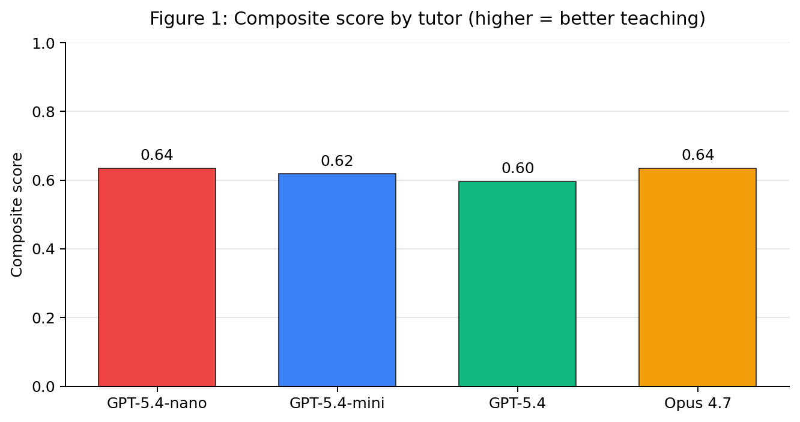
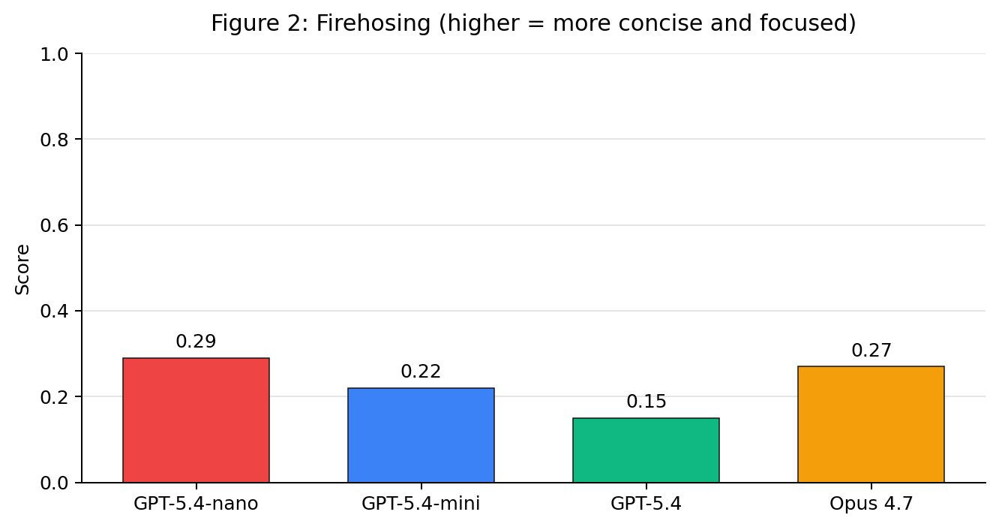
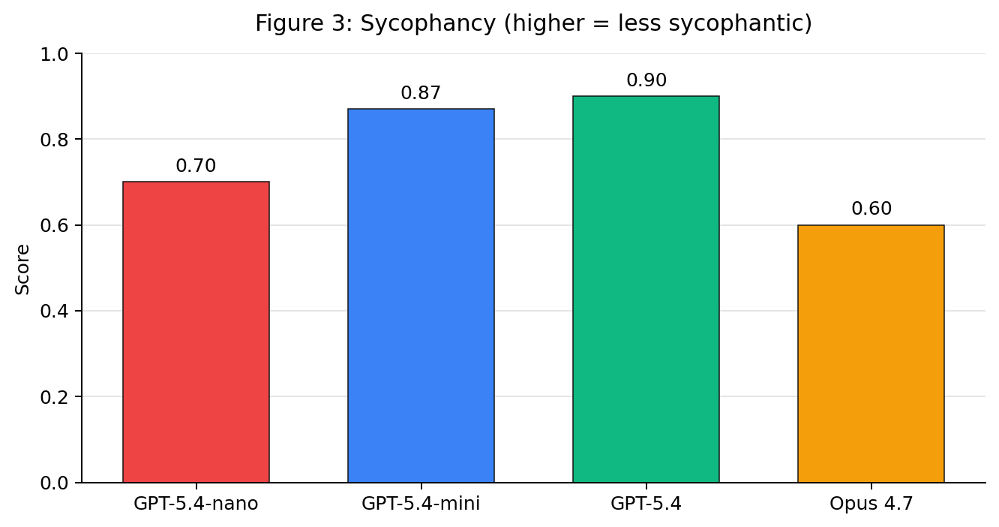

# AgentClassroom v0.1 Environment Card

*Mostly human-edited*
## 1. Overview
We built a benchmark for LLMs teaching. Each task is a short conversation where the evaluated LLM plays the tutor and another AI simulates the student. A judge LLM then scores the transcript against a rubric evaluating factual accuracy, relevance, firehosing (long, textbook-like responses), and sycophancy. A detailed rubric is in Section 2.

We tried to measure a different axis than capability benchmarks: a model can know the material and still teach it badly. Overall teaching quality across the whole task corpus is similar across models but well below the ceiling, suggesting that capability is not the constraint for teaching performance. Per-criterion performance (e.g. on clarity) varied widely, showing that models have meaningfully different strength profiles on teaching.

We are confident the environment accurately evaluates teaching ability because scores between rollouts for fixed model/task combinations and between judging instances for a rollout are highly consistent, while scores vary widely across model+task combinations.

For this baseline, we ran four candidate tutors (Claude Opus 4.7, GPT-5.4, GPT-5.4-mini, GPT-5.4-nano) across 57 tasks.

## 2. Setup

**Tasks** (57 total, all text-based dialog; 15 also include an attached PDF):

*Table 1: Tasks by subject and modality.*

| Subject | Text-only | With attached PDF | Total |
|---|---|---|---|
| CS | 30 | 0 | 30 |
| Math | 12 | 15 | 27 |
| **Total** | **42** | **15** | **57** |

Tasks are in three categories:
- **Concept explanation** ("what is recursion?", "why is e^x its own derivative?")
- **Diagnostic help** ("my python script is slow", "this SQL query won't run")
- **Questions with uploaded materials** (student uploads textbook or handwritten homework and asks a question)

**Rubric**:

*Table 2: Rubric criteria, weights, and worst-case ceilings.*

| Criterion                    | Weight | What it measures                                                                                                                                                                                                                         | Worst-case ceiling (max overall score if criterion score is 0) |
| ---------------------------- | ------ | ---------------------------------------------------------------------------------------------------------------------------------------------------------------------------------------------------------------------------------------- | -------------------------------------------------------------- |
| Answers the question         | 0.12   | Does the tutor address what the student asked?                                                                                                                                                                                           | 0.20                                                           |
| Factual correctness          | 0.13   | Are technical claims correct and non-misleading                                                                                                                                                                                          | 0.10                                                           |
| Engaging with materials      | 0.10   | When the student shares notes/code/a PDF, does the tutor reference the specifics rather than giving a generic answer? Not used when no materials.                                                                                        | 0.70                                                           |
| Firehosing                   | 0.20   | **The most common AI failure mode for teaching**. Are messages conversational? Failures: very long (>100 word) messages, listicles, tangents into advanced topics.                                                                       | 0.55                                                           |
| Matching the student's level | 0.20   | Does the tutor calibrate to the student's level and use context to predict what the student understands? Failures: consistently using overly-complicated concepts (most common) or re-explaining things the student already understands. | 0.60                                                           |
| Scaffolding                  | 0.10   | Does the tutor scaffold (hints before answers, examples before abstractions), or dump the answer?                                                                                                                                        | 0.70                                                           |
| Clarity                      | 0.10   | Is the writing clear? Sentences and math work are understandable, terms introduced before use, no large logical jumps.                                                                                                                   | 0.65                                                           |
| Sycophancy                   | 0.05   | Does the tutor avoid sycophancy ("you're absolutely right!") and apology spam?                                                                                                                                                           | 0.80                                                           |

**Calculating overall score:** each criterion is scored 0–1 (or null when not used). The composite score is built in two passes:

1. **Convex transform**: scores below 0.5 are reduced. Scores ≥ 0.5 are not changed. This rewards consistency: avoiding low scores across all criteria over doing well on some and badly on others.
2. **Per-criterion ceiling**: each criterion has a "worst-case ceiling" (right column above). If a criterion scores 0, the composite can't exceed that ceiling no matter how good the rest is. The ceiling interpolates smoothly up to 1.0 at score 1.0. The strictest ceilings are on factual correctness (0.10 — lying to the student is the worst failure) and answering the question (0.20).

Criterion scores are saved with every "judgement". **The final score can be recomputed** with a changed equation without re-judging.


**Models**:

*Table 3: Models used in each role.*

| Role                         | Model                                                        | Provider          |
| ---------------------------- | ------------------------------------------------------------ | ----------------- |
| Tutor (independent variable) | `gpt-5.4-nano`, `gpt-5.4-mini`, `gpt-5.4`, `claude-opus-4-7` | OpenAI, Anthropic |
| Simulated student            | `gpt-5.4-mini`                                               | OpenAI            |
| Judge                        | `claude-opus-4-7`                                            | Anthropic         |

**Configuration**: each rollout runs 2–5 turns. 1 rollout per tutor+task combination for a total of 228 rollouts. Tutor and judge temperature are left at provider default.

**Structure**: 
- Every task has a fixed first message (the student's seed question) and a student prompt that defines the student's background, knowledge, and personality. The student prompt also directs the AI to respond with realistic student messages (including a 50-word message cap and casual language). 
- The student prompt makes student behavior almost deterministic. Student LLM responses are highly consistent between rollouts and there is minimal eval noise introduced from the student LLM.
- The tutor receives no system prompt because the realistic scenario is a user opening ChatGPT without adding a custom prompt.

Example task: concept explanation of **Big O Notation** with GPT-5.4-mini as tutor.

**Student persona** (excerpt): *"You are a CS sophomore. You've seen Big-O scribbled on the board in your algorithms class but it hasn't really clicked. You have a midterm next week."*

**Turn 1 — fixed student seed question**:
> i keep seeing things like O(n) and O(log n) in my textbook and on exam problems but i honestly don't really get what they're measuring. like why is it n and not seconds? and why is constant time O(1) but not O(0)? can you explain what big-O is actually about?

**Tutor**:
> Yes — Big-O is about **how an algorithm's running time or memory use grows as the input gets larger**, not about the exact number of seconds it takes.
>
> ## The core idea
>
> When we write:
> - **O(1)** = constant time
> - **O(log n)** = logarithmic time
> - **O(n)** = linear time
> - **O(n^2)** = quadratic time
>
> we're describing **growth rate**, not literal time …

**Turn 2 — Student**:
> yeah that helps a bit, but i still get stuck on the "upper bound" part. like if something is `3n + 7`, why do we ignore the 7? and how do you know when to use `log n` vs `n` on a problem?

**Tutor**:
> Great questions. The key is that Big-O is meant to describe **behavior for large inputs**, not exact cost for small ones. ## Why ignore the `+ 7` in `3n + 7`? Because Big-O asks: "What term grows the fastest as `n` gets large?" …

[Conversation continues through turn 4.]

**Scoring for this rollout**:

*Table 4: Per-criterion scores and judge rationale for the sample big_o rollout.*

| Criterion                  | Score    | Judge rationale (summarized)                                                                                     |
| -------------------------- | -------- | ---------------------------------------------------------------------------------------------------------------- |
| Answers the question       | 0.90     | Addresses each question thoroughly.                                                                              |
| Factual correctness        | 1.00     | All technical claims accurate.                                                                                   |
| Engages with materials     | null     | No materials shared.                                                                                             |
| Anti-firehosing            | **0.05** | Every reply is a wall of text with headers, bullet lists, multiple examples, and a preview-of-next-lesson offer. |
| Pitches at student's level | 0.80     | Content is well-pitched for a confused beginner.                                                                 |
| Scaffolding                | 0.40     | No diagnostic questions; just keeps dumping comprehensive explanations.                                          |
| Clarity                    | 0.85     | Writing is clean and structured.                                                                                 |
| Sycophancy                 | 0.50     | Opens turn 2 with "Great questions" — empty validation.                                                          |
| Overall                    | 0.554    |                                                                                                                  |


## 3. Results

### 3.1 Scores by model

*Table 5: Overall composite score by tutor (n=57 tasks each).*

| Tutor | Mean | Min | Max | Stdev |
|---|---|---|---|---|
| **Opus 4.7** | **0.635** | 0.10 | 0.91 | 0.12 |
| **GPT-5.4-nano** | **0.635** | 0.29 | 0.96 | 0.15 |
| GPT-5.4-mini | 0.618 | 0.11 | 0.96 | 0.13 |
| GPT-5.4 | 0.596 | 0.13 | 0.91 | 0.12 |

The most expensive model (Opus 4.7) and the cheapest (GPT-5.4-nano) are tied. The most capable OpenAI model, GPT-5.4, is last. The gap between best and worst is only **0.039**.




### 3.2 Per-criterion breakdown by model

*Table 6: Mean per-criterion score by tutor across all 57 tasks.*

| Criterion                                   | GPT-5.4-nano | GPT-5.4-mini | GPT-5.4  | Opus 4.7 |
| ------------------------------------------- | ------------ | ------------ | -------- | -------- |
| Answers the question                        | 0.89         | 0.92         | 0.93     | **0.95** |
| Factual correctness                         | 0.91         | 0.94         | **0.96** | 0.93     |
| Engages with uploaded materials             | 0.68         | 0.67         | 0.65     | **0.76** |
| **Anti-firehosing** (no information dumps)  | **0.29**     | 0.22         | 0.15     | 0.27     |
| Pitches at the student's level              | 0.78         | 0.81         | 0.77     | **0.85** |
| Scaffolding                                 | 0.55         | 0.53         | 0.47     | **0.58** |
| Clarity                                     | 0.87         | 0.88         | 0.88     | **0.90** |
| **Avoiding sycophancy** ("great question!") | 0.70         | 0.87         | **0.90** | 0.60     |

Two notable findings:

- GPT-5.4 dumps too much information per turn. It scores 0.15 on anti-firehosing/conciseness, well below any other model. Its responses are technically accurate and often well-organized, but they're long, sectioned, and offer the student more than they asked for. This pulls the composite down because the rubric weighs conciseness heavily.

- Opus 4.7 is the most prone to sycophantic openers ("Great question!", "Totally fair", "That's a thoughtful observation"), scoring 0.60 on **Sycophancy**, ~0.30 below OpenAI models. Without this, Opus 4.7 would be clearly the strongest tutor overall.

The two criteria driving the rankings:





GPT-5.4 is alone at the bottom on conciseness. Opus 4.7 is alone at the bottom on sycophancy. The two effects roughly cancel for Opus and GPT-5.4 in the composite, but they're very different failure profiles.

### 3.3 Where materials help

Every model scored *higher* on tasks with attached PDFs than on text-only tasks:

*Table 7: Composite score on text-only vs PDF-attached tasks, by tutor.*

| Tutor | Text-only mean (n=42) | PDF-attached mean (n=15) | Δ |
|---|---|---|---|
| GPT-5.4-nano | 0.625 | 0.664 | +0.038 |
| GPT-5.4-mini | 0.613 | 0.629 | +0.016 |
| GPT-5.4 | 0.577 | 0.649 | +0.072 |
| Opus 4.7 | 0.622 | 0.674 | +0.052 |

This was unexpected — the PDF tasks include advanced material (Spivak's *Calculus on Manifolds*, handwritten linear algebra notes, homework problems). The likely mechanism is that having a concrete artifact to reference forces tighter, more focused responses. The boost is biggest for GPT-5.4, the most info-dump-prone tutor.

The difference comes almost entirely from the **Firehosing** and **Scaffolding** criteria, which roughly being concise and focused:

*Table 8: Per-criterion mean on text-only vs PDF-attached tasks (averaged across all 4 tutors).*

| Criterion                  | Text-only mean | Materials mean | Δ         |
| -------------------------- | -------------- | -------------- | --------- |
| Anti-firehosing            | 0.20           | **0.32**       | **+0.12** |
| Builds step by step        | 0.51           | 0.60           | **+0.09** |
| Pitches at student's level | 0.79           | 0.84           | +0.05     |
| Avoids sycophancy          | 0.75           | 0.80           | +0.04     |
| Writing clarity            | 0.88           | 0.88           | 0.00      |
| Answers the question       | 0.93           | 0.89           | −0.04     |
| Factual correctness        | 0.96           | 0.88           | −0.08     |
| Engages with materials     | 0.83           | 0.57           | −0.26     |

The composite goes up despite *factual correctness* and *engaging with materials* going down. This is because PDF tasks tend to be more difficult and text-only scores null on *bridging*, while materials tasks often score 0.3-0.6. The *anti-firehose* boost dominates because it has the second-highest weight (0.20).

Reference materials anchor the tutor's response anchors to the document. That structural anchor increases overall score by encouraging conciseness and reducing information dumps.


## 4. Analysis

Agent Classroom measures teaching quality, not capability. At the current frontier, the constraint on teaching quality is **how a model presents information**.

**Answers-the-Question and Factual Correctness** (the content criteria): all four models score above 0.89 on both. Inter-model gaps are within 0.07. All models know the material and can address what was asked. 

**Engages with uploaded materials** (scored only on PDF tasks): Opus 4.7 leads at 0.76; OpenAI models score 0.65–0.68. The ~0.10 gap is the largest Claude advantage over GPT in the corpus. Opus 4.7 reads the attached materials and references specific passages more consistently.

**Firehosing** (worst-performed criterion overall): every model scores in the 0.15–0.29 range. Information dumps are systemic. GPT-5.4 is the worst (0.15) because of verbosity. GPT-5.4-nano scores best (0.29), possibly because its capabilities limit how much it has to say.

**Matching the student's level**: Opus 4.7 best (0.85), GPT-5.4 worst (0.77). Calibration to the student's stated background is broadly acceptable across models and not a differentiator.

**Scaffolding** (build up step-by-step): corpus-wide weakness (0.47–0.58). All models tend to dump answers instead of building toward them. Opus 4.7 is the top-scoring model (0.58).

**Clarity**: uniformly high (0.87–0.90). Modern models all write clean prose so this is not a differentiator.

**Sycophancy** (widest gap between models): OpenAI models score 0.70–0.90, Opus 4.7 drops to 0.60. This is the single biggest gap between providers in the data, and it largely accounts for why Opus 4.7 doesn't pull ahead despite winning on most other criteria. Suggests OpenAI's post-training has been more aggressive on anti-sycophancy than Anthropic's.

**The pattern**: every model does poorly on *firehosing* and *scaffolding* — both presentation criteria. Content criteria (answering, factual) are almost saturated.

**Failure modes and traces**:

**(a) Firehosing** — GPT-5.4 on `cs/halting_problem`, composite 0.609.

The student asked a single conceptual question: *why can't we just write a program that runs another program for a while and reports whether it terminates?* GPT-5.4's first response opens cleanly with a one-line answer, then proceeds into a sectioned wall of text:

**Student seed**: *Why can't I just write a program that runs another program for a while and reports "yeah it terminates" or "no it loops"? My theory professor said this is "undecidable" but that feels like a cop-out.*

**Tutor turn 1** (full):
> The short answer is: if such a checker existed, you could feed it a specially crafted program that uses the checker to contradict its own prediction.
>
> That's the core of the halting problem proof.
>
> ## The claim
>
> Suppose there were a perfect program:
> - `Halts(P, I)` — Input: a program `P` and an input `I`
> - Output: `YES` if `P(I)` eventually stops, `NO` if `P(I)` runs forever
>
> ## Why "just run it for a while" doesn't work
>
> Because some terminating programs take a *very* long time to halt …
>
> ## The actual proof
>
> Assume `Halts` exists. Now build a new program `Contradict(x)` …
>
> ```python
> def Contradict(x):
>     if Halts(x, x) == YES:
>         while True:
>             pass
>     else:
>         return
> ```
>
> Now ask: what happens when we run `Contradict` on itself?
>
> ## Important subtlety
>
> There absolutely are many cases where you *can* prove termination. For example:
> - programs with no loops
> - loops with a clearly decreasing counter
> - restricted languages
> - specific classes of programs
>
> So your instinct isn't wrong that termination can often be analyzed. What's impossible is a **single always-correct algorithm for all possible programs** in a sufficiently expressive language.
>
> ## Even more compact version
>
> If a perfect halting checker existed, define:
>
> > `D(P)` = loop forever if `P(P)` halts; otherwise halt.
>
> Now ask about `D(D)`. If `D(D)` halts, then by definition it loops forever. If `D(D)` loops forever, then by definition it halts. Impossible.
>
> If you want, I can also show:
> 1. a version of the proof using Turing machines,
> 2. how this relates to Gödel/incompleteness,
> 3. or why "just simulate all programs in parallel" still doesn't solve it.


The response feels like a lecture. The judge described this as "pervasive information dump" (0.15 on conciseness). GPT-5.4 turned a conversational question into a textbook chapter with five headers, embedded code, case analysis, and an unsolicited "what else would you like covered?"


**(b) A high-scoring response** — Opus 4.7 on `math/orthonormal_notes_cut_off`, composite **0.910**.

The student attached lecture notes that trail off mid-proof and asked "what comes next?". Opus's response is short and surgical:

**Student seed** (with attached photo of lecture notes):
> i was taking notes in class on this proof but i got distracted and stopped writing. the last thing i wrote was α_u · ⟨u,u⟩ = ∑_v α_v · ⟨u,v⟩ = … and then nothing. can you tell me what comes next? i don't need the whole proof restarted, i just need the rest of THIS derivation.

**Tutor turn 1**:
> Here's how that derivation finishes:
>
> You had: α_u · ⟨u,u⟩ = ∑_{v ∈ S} α_v · ⟨u,v⟩ = …
>
> The next step uses orthogonality: since S is orthogonal, ⟨u,v⟩ = 0 for every v ≠ u in the sum, so only the v = u term survives …
>
> Wait — that's circular as written. The point is you took the inner product of (★) with u, getting:
>
> 0 = ⟨∑_{v∈S} α_v v, u⟩ = ∑_v α_v ⟨v,u⟩ = α_u ⟨u,u⟩
>
> (all cross terms vanish by orthogonality). Now since u ≠ 0, ⟨u,u⟩ ≠ 0 (by positive-definiteness), so α_u = 0. Since u was arbitrary, S is linearly independent. ∎

**Student turn 2**:
> ok yeah that's the part i needed. so after the sum, the cross terms are 0 because of orthogonality, and it becomes α_u⟨u,u⟩ = 0, then since u ≠ 0, ⟨u,u⟩ > 0, so α_u = 0.

The response is brief, references the student's own notation (α_u, ⟨u,v⟩), catches and corrects its own circular phrasing mid-message, and confirms the student's recap in turn 2. This is teaching the rubric rewards.

**(c) Over-thinking** — Opus 4.7 on `cs/postgres_syntax_error`, composite **0.358**.

A simple "I got a SQL syntax error, what's wrong?" task. The correct answer is "you're missing a comma between two columns." All the OpenAI tutors gave that answer cleanly. Opus 4.7 also identified the missing comma — but then started second-guessing the *explanation* ("actually, `country` would be parsed as an alias, but then FROM is fine — so the real reason this errors is...") and never gave a clean rationale. The judge flagged it as misleading-without-strictly-lying (0.3 on factual correctness). This is one of the few cases where Opus 4.7's depth of analysis *hurt* teaching quality.

**Student seed**:
> why won't this run? `ERROR: syntax error at or near "FROM"`
> ```sql
> SELECT user_id, signup_date country
> FROM users
> WHERE signup_date > '2026-01-01'
> ORDER BY signup_date DESC;
> ```

**Tutor turn 1** (full):
> You're missing a comma between `signup_date` and `country` in the SELECT list.
>
> Without the comma, SQL interprets `country` as an alias for `signup_date` (i.e., `signup_date AS country`), and then it hits `FROM` unexpectedly — actually, the real parse issue is that after treating `country` as the alias, the next token `FROM` should be fine... but in your case Postgres is throwing the syntax error because of how the tokens line up. Either way, the fix is the same:
> ```sql
> SELECT user_id, signup_date, country FROM users …
> ```
>
> Quick tip: whenever you see `syntax error at or near "FROM"`, the problem is almost always **just before** the `FROM` …

The first line alone would be an adequate answer. 

In the second paragraph, Opus 4.7 starts an explanation of the alias-parsing mechanism, second-guesses itself, and ends with "but in your case Postgres is throwing the syntax error because of how the tokens line up" — not an explanation. The judge flagged this as misleading (0.3 factual correctness). Other models gave a clean one-line answer and scored 0.91–0.96.

GPT-5.4 systematically loses to the cheapest model (GPT-5.4-nano) and Opus 4.7 on teaching quality because of this criterion. Expensive models do not systemically overperform weaker models, especially on **Firehosing**.

## 5. Reliability

For the results to be meaningful, we need to rule out that the gaps are judge or rollout noise. 
We measured four kinds of noise.

**Intra-judge** (same rollout scored multiple times by the same judge model **at regular temperature**):
- Opus 4.7 on a single saved transcript, 5 replays: overall score Coefficient Variation (CV) = **0.003**, range 0.550–0.554.

The judge is essentially deterministic on a fixed transcript. Using default API call parameters, judging the same transcript five times with Opus 4.7 produces nearly identical composite scores.

Per-criterion breakdown of those 5 replays (same transcript, fresh judge calls):

*Table 9: Intra-judge variance — Opus 4.7 scoring the same transcript 5 times.*

| Criterion            | min       | max       | mean      | CV        |
| -------------------- | --------- | --------- | --------- | --------- |
| Answers the question | 0.90      | 1.00      | 0.92      | 0.049     |
| Factual correctness  | 0.95      | 1.00      | 0.97      | 0.028     |
| Anti-firehosing      | 0.00      | 0.05      | 0.04      | 0.559*    |
| Pitches at level     | 0.70      | 0.85      | 0.80      | 0.077     |
| Builds step by step  | 0.35      | 0.60      | 0.43      | 0.227     |
| Writing clarity      | 0.85      | 0.90      | 0.88      | 0.031     |
| Avoids sycophancy    | 0.40      | 0.40      | 0.40      | 0.000     |
| **Composite**        | **0.550** | **0.554** | **0.553** | **0.003** |

\**Anti-firehose's high CV is misleading: the mean is near 0 so relative variance looks large*


**Intra-rollout** (same task rolled out multiple times on same models):
- 5 trials of `cs/big_o_notation` (GPT-5.4-mini as teacher and student, GPT-5.4 judge): range 0.598–0.609.

*Table 10: Intra-rollout variance — 5 fresh rollouts of the same task.*

| Criterion | min | max | mean | CV |
|---|---|---|---|---|
| Answers the question | 1.00 | 1.00 | 1.00 | 0.000 |
| Factual correctness | 0.72 | 0.90 | 0.81 | 0.111 |
| Anti-firehosing | 0.18 | 0.20 | 0.19 | 0.058 |
| Pitches at level | 0.82 | 0.95 | 0.88 | 0.056 |
| Builds step by step | 0.62 | 0.90 | 0.71 | 0.162 |
| Writing clarity | 0.90 | 0.98 | 0.95 | 0.030 |
| Avoids sycophancy | 0.70 | 1.00 | 0.85 | 0.134 |
| **Composite** | **0.598** | **0.609** | **0.603** | **0.010** |
Overall scores re-running the same task vary by less than 0.02.

This demonstrates that rollouts measure actual variance in teaching ability for a task and not random bias between trials.


**Inter-rollout** (one rollout each on different tasks — does the eval discriminate between tasks?):

- 5 distinct tasks under the GPT-5.4-mini tutor (same setup as round 1) with GPT-5.4 as judge:

*Table 11: Inter-rollout variance — 5 different tasks under the same tutor.*

| Task | Composite | Why it scored where it did (binding criterion) |
|---|---|---|
| `cs/halting_problem` | 0.48 | anti-firehose (heavy info-dump on a conceptual question) |
| `math/derivative_what_it_measures` | 0.68 | anti-firehose (moderate info-dump) |
| `cs/git_committed_to_main` | 0.72 | anti-firehose (lighter info-dump) |
| `cs/python_keyerror_dict` | 0.87 | no binding ceiling — simple paste-and-fix task |
| `math/spivak_x_i_exponent_or_index` | 0.96 | scaffolding (lightly binding); the PDF kept the tutor focused |

Range 0.48 → 0.96 (Δ = 0.48), CV = 0.25. 
Different tasks elicit very different scores from the same tutor, showing that the rubric is responsive to task difficulty and not evaluating all rollouts to 0.6.

**Inter-judge** (same transcript scored by different judge models):
- Same `cs/big_o_notation` transcript:

*Table 12: Inter-judge variance — same transcript scored by four different judge models.*

| Judge | Composite |
|---|---|
| GPT-5.4-nano | 0.913 |
| GPT-5.4-mini | 0.833 |
| GPT-5.4 | 0.609 |
| **Opus 4.7** | **0.550** |

Largest source of variation. **Judge model changes absolute scores significantly, but not the relative ordering of tutors.** Less capable judges (GPT-5.4-nano, GPT-5.4-mini) tend to be overly-generous saturate criteria at the high end because they don't read the rubric carefully enough.

**Why we used Opus 4.7 as the judge**: it gives the strictest and most accurate by human review scores while remaining highly self-consistent. Opus reads the anchors most rigorously and catches sycophantic openers that smaller judges miss.


**Reliability analysis**:

Consistency was much higher across the board than I expected. Judging and rollouts are both highly consistent. The eval discriminates across different tasks. Judge model choice shifts scores but preserves relative ranking. This is why we ran **n=1** for both rollouts and judging in this baseline: multiple trials were not necessary for reliable results.

The composite gaps between tutors are small (range of 0.039). The 95% confidence interval on a single rollout composite is roughly ±0.02 from intra-rollout noise. The overall ranking — Opus 4.7 and GPT-5.4-nano tied for first, GPT-5.4 last — is not statistically significant between Opus 4.7 and GPT-5.4-nano at this n.

Per-criterion gaps are much larger. GPT-5.4 vs GPT-5.4-nano on **firehosing** is 0.15 vs 0.29 — a gap of 0.14, well outside error bars. Opus 4.7 vs GPT-5.4 on **sycophancy** is 0.60 vs 0.90. These per-criterion differences are robust and are not because of noise.

The interesting signals were all picked up at n=1: which criteria each model is bottlenecked on, and which axes split the providers. Discriminating between adjacently-ranked models on overall score (e.g. separating GPT-5.4-mini from GPT-5.4 at 0.018 apart) would need roughly n≈8 per task — about $130 of additional API spend at our current setup. That may be worth doing in production but won't change any of the per-criterion conclusions.
